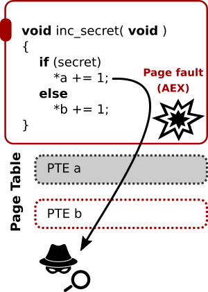

# Increment secret: An elementary page fault attack

Even before the official launch of Intel SGX, researchers showed the existence
of a [dangerous
side-channel](https://www.microsoft.com/en-us/research/wp-content/uploads/2016/02/ctrlchannels-oakland-2015.pdf)
within the processor's virtual-to-physical address translation logic.  By
revoking access rights on selected enclave memory pages, and observing the
associated page fault patterns, adversaries controlling the operating system
can deterministically establish enclaved code and data accesses at a 4 KiB
granularity.  This attack technique has been proven highly practical and
effective, extracting full enclave secrets in a single run and without noise.



## Your task

Consider the following enclave function that increments a global variable `a`,
depending on some secret.

```C
void ecall_inc_secret(int s)
{
    if (s)
        a += 1;
}
```

**Do it yourself.** Edit the untrusted main function to reconstruct the secret
enclave input `s` based on the page fault pattern for the global variable `a`.
Some guidance notes:

* You can make use of the
    [mprotect](http://man7.org/linux/man-pages/man2/mprotect.2.html) library
    function to alter page-granular access rights.
* SGX enclaves are loaded at runtime as a shared library object. This means
    that all addresses you obtain from an `objdump` need to be incremented with the
    base load address of the enclave. Enclave load addresses are
    attacker-controlled, and can hence be obtained by modifying the untrusted
    runtime, but we already provide you with an `ecall_get_a_adrs` function to more
    easily get started.
* The provided skeleton program already takes care to redirect any page faults
    to the `fault_handler` function.
* Make sure to test both with an input `s=1` and `s=0` to make sure your attack
    proplerly handles both cases.

**Note.** For testing purposes, we pass the secret input `s` as plain text from
the main function, but in a real-world scenario the secret input would be
end-to-end encrypted so that only the enclave can see it.

### Defeating naive page fault access pattern defenses

Consider the following "hardened" version of the vulnerable increment function.
The idea is to hide the secret-dependent enclave page access, by always performing
a dummy access on the global variable `a` immediately after the secret branch.

```C
void ecall_inc_secret_maccess(int s)
{
    if (s)
        a += 1;

    /* DEFENSE IDEA: let's always access 'a', independent of the secret */
    volatile int b = a;
}
```

**Do it yourself.** Verify that your attack against `ecall_inc_secret` indeed
does _not_ anymore work against the hardened version above. Now, come up with a
way to refine your attack and distinguish the secret-dependent access from the
dummy access.

## Solution and Explanation
The solution and explanation is same as that for _002-inc-secret_ example.

Check the `main.c` file for implementation.

### ecall_inc_secret()
We observe that the if the `secret` is 1, `a` will be accessed and if it is 0, it will not be accessed (and vice-versa).

So, we need to find if the `a` is accessed or not. This can be detected if we can find if the page containing `a` is accessed or not.

So, we mark the page containing the variable `a` as NOT_ACCESSIBLE (`PROT_NONE`). It will result in PAGE_FAULT if `a` is accessed and we can note it down. (We can additionally check if the PAGE_FAULT was for the same page containing `a` but it is not necessary for this experiment.)

### ecall_inc_secret_maccess()
The difference with the above is that the page is always accessed thanks to `b=a`. So, the above method will not work.

But there is a difference, `a` is written (`a+=1`) ONLY if `secret` is 1, otherwise it is only read.

So, we mark the page containing the variable `a` as READ_ONLY (`PROT_READ`). It will result in PAGE_FAULT only if `a` is modified/written and we can note it down.

**Note:** Don't forget to mark the page WRITABLE (`PROT_WRITE`) in handling the page fault, otherwise it will end in infinite page faults.