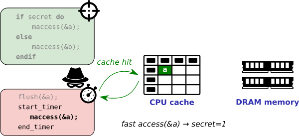

# Flush+Reload: Spying on _unprotected_ memory accesses

The previous execution timing attack example measured an obvious timing
difference caused by early-outing a function (i.e., executing more vs. less
instructions before returning).  Most real-world programs do not exhibit such
explicit input-dependent timing dependencies, however, and we need another way
to extract information.  We will therefore abuse subtle timing differences
caused by the underlying CPU cache to infer memory accesses by the victim.

If the attacker and the victim share some memory locations (e.g., as is often
the case for shared library code), we can rely on the seminal Flush+Reload
attack technique. This technique is conceptually very simple, but has been
proven to be extremely powerful (e.g., Flush+Reload has recently been applied
for instance as an important building block for the high-impact Meltdown,
Spectre, and Foreshadow attacks).  Flush+Reload proceeds in 3 distinct phases
to determine whether a victim program accessed some shared data _A_:

1. **Flush.** The attacker first initializes the shared CPU cache in a known
    state by explicitly flushing the address _A_ from the cache.  This ensures that
    any subsequent access to _A_ will suffer a cache miss, and will hence be
    brought back into the cache from memory.

2. **Victim execution.** Now the attacker simply waits for the victim to
    execute. If a certain secret is true, the victim will load some data _A_ into
    the cache. If the secret is false, however, the victim loads some other data
    _B_ into the cache.

3. **Reload.** After completing the victim execution, the attacker measures the
    amount of time (CPU clock cycles) it takes to reload the shared data _A_. A
    fast access reveals that the victim execution in step 2 above brought _A_ into
    the cache (i.e., cache hit, secret = true), whereas a slow access indicates
    that _A_ was not accessed during the victim's execution (i.e., cache miss,
    secret = false).
    


## Your task

Consider the example victim enclave program.  Describe a way to mount a
successful Flush+Reload attack to reconstruct the `secet_idx` lookup index, solely
through timing differences induced by the CPU cache?

```C
void ecall_secret_lookup(char *array, int len)
{
    c = array[(4096*secret_idx) % len];
}

```

**Do it yourself.** Edit the main function to implement the missing "flush"
and "reload" attacker phases. You can use respectively the provided `void
flush(void *adrs)` and `int reload(void *adrs)` functions.  The latter returns
the CPU cycle timing difference needed for the reload.  If necessary,
compensate for timing noise from modern processor optimizations by repeating
the Flush+Reload experiment (steps 1-3 above) a sufficient amount of times and
taking the median or average.

> Sample output (secret=4, NUM_SAMPLES=5):

```
Time slot   0 (CPU cycles): 254
Time slot   1 (CPU cycles): 256
Time slot   2 (CPU cycles): 254
Time slot   3 (CPU cycles): 258
Time slot   4 (CPU cycles): 80
Time slot   5 (CPU cycles): 262
Time slot   6 (CPU cycles): 266
Time slot   7 (CPU cycles): 254
Time slot   8 (CPU cycles): 252
Time slot   9 (CPU cycles): 254
```

### Launching the attack on real SGX hardware

Now you have the proof-of-concept attack working in an _unprotected_
application on your own laptop, proceed to the `../003-sgx-flush-and-reload` program
to try and port your attack to a real Intel x86 SGX processor.

## Solution and Explanation
Check `main.c` file for the implementation.

As we can see, the array size is 10\*4KB and we are accessing the elements at indices 4096\*idx (4KB gap). **This means that all our accesses are from different pages in RAM.**

If the attacker accesses an idx, that element (alongwith neighbour data, granularity definitely < 4KB) will be brought to cache. This means that other elements will remain in RAM.

So, if we access all the elements again, the previously accessed one must take significantly less time as compared to the others.

As explained above, the 3 steps in Flush+Reload attacks are:
1. **Flush the data:** The attacker flushes the complete array from the cache.
2. **Victim execution:** The victim accesses the element corresponding to `secret_idx`.
3. **Reload:** The attacker reloads the elements back and notes down the time taken for each access.

The program printed the following results:
```
Time slot   0 (CPU cycles): 545
Time slot   1 (CPU cycles): 533
Time slot   2 (CPU cycles): 529
Time slot   3 (CPU cycles): 533
Time slot   4 (CPU cycles): 533
Time slot   5 (CPU cycles): 545
Time slot   6 (CPU cycles): 549
Time slot   7 (CPU cycles): 173
Time slot   8 (CPU cycles): 545
Time slot   9 (CPU cycles): 528
```
We can observe that the time taken for slot 7 is significantly less than the other slots and hence the `secret_idx` is 7.

## Further work
If someone wants to work further, they can try this attack for small arrays.

**Ex.** The T-table in AES has 256 entries, 4 bytes each. Can you guess which idx was accessed for this array?

**How is it different as compared to the above situation?**
> In the above setup, all the elements accessed were very far, and when one of them was accessed, only that was brought to cache and others remained in RAM. This gave us much better results.
> For this situation, the elements are "near" in memeory, and when one of these will be accessed, nearby elements will also be brought to cache (BUT NOT TO L1 CACHE).
> The L1 cache line-size is 64 Bytes in most of the modern computers, which means that 16 of the elements reside in same line. So, only they will be brought to L1 cache. The others will reside in L2 or L3 cache.
> Can you differentiate between these? If the element is in L1 or not?

**Details:**
1. NUM_SLOTS = 16
2. SLOT_SIZE = 64 (Bytes)
3. ARRAY_LEN = NUM_SLOTS\*SLOT_SIZE = 256\*4 Bytes
4. Change `aligned(0x1000)` to `aligned(64)` in `main.c`
5. Change the value from 4096 to 64 in `victim.c`

### My Results

```
Time slot   0 (CPU cycles): 597
Time slot   1 (CPU cycles): 194
Time slot   2 (CPU cycles): 194
Time slot   3 (CPU cycles): 199
Time slot   4 (CPU cycles): 194
Time slot   5 (CPU cycles): 198
Time slot   6 (CPU cycles): 198
Time slot   7 (CPU cycles): 199
Time slot   8 (CPU cycles): 198
Time slot   9 (CPU cycles): 194
Time slot  10 (CPU cycles): 198
Time slot  11 (CPU cycles): 199
Time slot  12 (CPU cycles): 198
Time slot  13 (CPU cycles): 198
Time slot  14 (CPU cycles): 198
Time slot  15 (CPU cycles): 194
```

As we can see, all the accesses take almost same time as they are in cache (except the slot 0).

The program is not able to distingush between the `secret_idx` (which is 7) and others  in this setup.

**If you find any solution to this problem, please share it.**