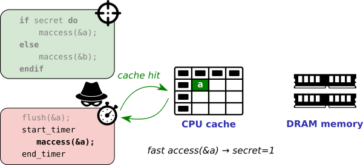

# Flush+Reload: Spying on _unprotected_ memory accesses

The previous execution timing attack example measured an obvious timing
difference caused by early-outing a function (i.e., executing more vs. less
instructions before returning).  Most real-world programs do not exhibit such
explicit input-dependent timing dependencies, however, and we need another way
to extract information.  We will therefore abuse subtle timing differences
caused by the underlying CPU cache to infer memory accesses by the victim.

If the attacker and the victim share some memory locations (e.g., as is often
the case for shared library code), we can rely on the seminal Flush+Reload
attack technique. This technique is conceptually very simple, but has been
proven to be extremely powerful (e.g., Flush+Reload has recently been applied
for instance as an important building block for the high-impact Meltdown,
Spectre, and Foreshadow attacks).  Flush+Reload proceeds in 3 distinct phases
to determine whether a victim program accessed some shared data _A_:

1. **Flush.** The attacker first initializes the shared CPU cache in a known
    state by explicitly flushing the address _A_ from the cache.  This ensures that
    any subsequent access to _A_ will suffer a cache miss, and will hence be
    brought back into the cache from memory.

2. **Victim execution.** Now the attacker simply waits for the victim to
    execute. If a certain secret is true, the victim will load some data _A_ into
    the cache. If the secret is false, however, the victim loads some other data
    _B_ into the cache.

3. **Reload.** After completing the victim execution, the attacker measures the
    amount of time (CPU clock cycles) it takes to reload the shared data _A_. A
    fast access reveals that the victim execution in step 2 above brought _A_ into
    the cache (i.e., cache hit, secret = true), whereas a slow access indicates
    that _A_ was not accessed during the victim's execution (i.e., cache miss,
    secret = false).
    


## Your task

Consider the example victim enclave program.  Describe a way to mount a
successful Flush+Reload attack to reconstruct the `secet_idx` lookup index, solely
through timing differences induced by the CPU cache?

```C
void ecall_secret_lookup(char *array, int len)
{
    if (!sgx_is_outside_enclave(array, len))
        return;

    c = array[(4096*secret_idx) % len];
}

```

**Do it yourself.** Edit the main function to implement the missing "flush"
and "reload" attacker phases. You can use respectively the provided `void
flush(void *adrs)` and `int reload(void *adrs)` functions.  The latter returns
the CPU cycle timing difference needed for the reload.  If necessary,
compensate for timing noise from modern processor optimizations by repeating
the Flush+Reload experiment (steps 1-3 above) a sufficient amount of times and
taking the median or average.

> Sample output (secret=4, NUM_SAMPLES=5):

```
Time slot   0 (CPU cycles): 254
Time slot   1 (CPU cycles): 256
Time slot   2 (CPU cycles): 254
Time slot   3 (CPU cycles): 258
Time slot   4 (CPU cycles): 80
Time slot   5 (CPU cycles): 262
Time slot   6 (CPU cycles): 266
Time slot   7 (CPU cycles): 254
Time slot   8 (CPU cycles): 252
Time slot   9 (CPU cycles): 254
```

## Solution and Explanation
The solution and explanation is same as `003-flush-and-reload` tutorial.

Check `main.c` file for the implementation.

As we can see, the array size is 10\*4KB and we are accessing the elements at indices 4096\*idx (4KB gap). **This means that all our accesses are from different pages in RAM.**

If the attacker accesses an idx, that element (alongwith neighbour data, granularity definitely < 4KB) will be brought to cache. This means that other elements will remain in RAM.

So, if we access all the elements again, the previously accessed one must take significantly less time as compared to the others.

As explained above, the 3 steps in Flush+Reload attacks are:
1. **Flush the data:** The attacker flushes the complete array from the cache.
2. **Victim execution:** The victim accesses the element corresponding to `secret_idx`.
3. **Reload:** The attacker reloads the elements back and notes down the time taken for each access.

The program printed the following results:
```
Time slot   0 (CPU cycles): 234
Time slot   1 (CPU cycles): 230
Time slot   2 (CPU cycles): 252
Time slot   3 (CPU cycles): 260
Time slot   4 (CPU cycles): 254
Time slot   5 (CPU cycles): 252
Time slot   6 (CPU cycles): 253
Time slot   7 (CPU cycles): 65
Time slot   8 (CPU cycles): 230
Time slot   9 (CPU cycles): 256
```
We can observe that the time taken for slot 7 is significantly less than the other slots and hence the `secret_idx` is 7.

## Further work
Please check the README of `003-flush-and-reload` tutorial for a different setup.