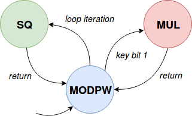

# RSA: An elementary 16-bit crypto attack scenario

Cryptographic software is widely studied in side-channel attack research. This
exercise considers a toy enclave that implements a basic 16-bit version of the
RSA cryptosystem using the square-and-multiply algorithm with message blinding
protection.  The implementation is definitely not meant to be cryptographically
secure, but serves as an elementary case study application to analyze
side-channel leakage in enclave programs. 

## Background: Square and multiply

Modular exponentiation is the main ingredient of public key
algorithms such as RSA, and is commonly implemented using the
_square-and-multiply_ algorithm.  To compute _m = c^d_, square-and-multiply
iterates over the binary representation of _d_, repeatedly squaring _m_ each
iteration, and performing an extra multiplication of _m_ with _c_ in case the
bit in _d_ was set. Square-and-multiply thus branches on a secret each loop
iteration, making it a widely studied algorithm in side-channel analysis
research. Furthermore, naive implementations are known to be vulnerable to a
classical start-to-end execution timing attack that supplies carefully crafted
input messages to yield a measurable difference for individual key bits in the
total runtime of the program. The recommended countermeasure for this type of
timing attacks involves _message blinding_, where the input is masked with a
random factor before modular exponentiation takes place, and afterwards
canceled out.

## Your task

Your job is to extract the 16-bit private RSA key by observing side-effects
of the `ecall_rsa_decode` enclave entry point, which internally executes
square-and-multiply by iterating over the private key bits:

```C
int modpow(long long a, long long b, long long n)
{
    long long res = 1;
    uint16_t mask = 0x8000;

    for (int i=15; i >= 0; i--)
    {
        res = square(res, n);
        if (b & mask)
            res = multiply(res, a, n); 
        mask = mask >> 1;
    }
    return res;
}
```

**Note.** Real-world crypto libraries typically offer specialized helper
functions to multiply big numbers. This is abstracted in our rudimentary 16-bit
implementation by the dedicated `square` and `multiply` functions.

Some further guidance:

* The helper functions `square` and `multiply` are declared in `asm.S`, and are for
    this exercise explicitly allocated on separate code pages. (Again, note that
    this is often the case in real-world crypto libraries due to the complexity of
    the big number computation functions.)
* **For the enclave version, `modpow` is not expliticly aligned to a dedicated
    code page.** As such, the code for `modpow` may share a memory page with
    other enclave code, but your attack should still work if it correctly
    recognized page fault sequences.
* Simply monitoring the accesses on either `square` or `multiply` won't get you
    far, as this only reveals the _total_ number of one bits in the private key
    (which is supposed to be randomly distributed anyway).
* To reveal _individual_ private key bits, you will have to monitor the **page
    fault sequences** of the `square`, `multiply`, and `modpow` code pages with a
    simple state machine as follows:



* Be aware that `ecall_rsa_decode` first performs blinding on the input
    parameter through a `modpow` call with a _known_ exponent (rsa_e). As such,
    your attacker code will have to ignore the first call to `modpow` and only
    focus on page fault side-effects of the second `modpow` invocation with
    the secret argument (rsa_d). You can start with commenting out the first
    `modpow` call if that helps.

## Solution and Explanation
The solution and explanation is same as `005-rsa` tutorial.

Check `main.c` file for implementation.

As explained above, the change of states, or executing different functions, or accesses to different pages, depends on the value of `rsa_d` and vice-versa.

Let's undertand the execution of the `modpow` function:
```C
int modpow(long long a, long long b, long long n)
{
    long long res = 1;
    uint16_t mask = 0x8000;

    for (int i=15; i >= 0; i--)
    {
        res = square(res, n);
        if (b & mask)
            res = multiply(res, a, n); 
        mask = mask >> 1;
    }
    return res;
}
```

If the particular bit of `rsa_d` (second argument) is 0, then only `square` is executed(or accessed), otherwise `square` followed by `multiply` are executed.

After every `square` or `multiply` (returning from the respective function), the program executes the `modpow` function.

### Page Fault Handler
We will start with marking the `modpow` page as NON_EXECUTABLE (`PROT_NONE`).

The program will trigger a page fault while executing it, and we will note it down and mark it EXECUTABLE (`PROT_EXEC`) again. Also, we will mark the other 2 pages as NON_EXECUTABLE(as it is the first time), so that they will also cause page fault on execution.

After the 1st case, on each page fault(due to `modpow`/`square`/`multiply`), we will note it down, mark it EXECUTABLE, and mark the previous page(which we marked EXECUTABLE last time) as NON_EXECUTABLE.

This will provide us complete page access sequence.

### Finding `rsa_d`
Now we have the page access sequence, we just need to figure out if the correcponding bit was '1' (`square` and `multiple`) or '0' (`square`).

**Ex.** Let's see the following sequence: (1:`modpow`, 2:`square`, 3:`multiply`)
```
Access pattern: Access pattern: 1 2, 1 2 1 3, 1 2 1 3, 1 2, 1 2, 1 2 1 3, 1 2 1 3, 1 2 1 3, 1 2, 1 2, 1 2, 1 2, 1 2 1 3, 1 2 1 3, 1 2 1 3, 1 2 1 3, 1
```
I have additionally separated them by commas to easily understand the sequence.

As we can observe, the bits are 0 1 1 0 0 1 1 1 0 0 0 0 1 1 1 1, which means `rsa_d` = `26383`.

### Countermeasure - Random Blinding
In this case, `powmod` is called twice, first for blinding (`rsa_e`), and again for actual decoding (`rsa_d`).

Now, we will see the combined page access sequence and need to figure out the separation (of `rsa_e` and `rsa_d`) ourselves.

This is easy to do as we know that each sequence corresponds to 16 bits.

**Ex.** Let's see the following sequence: (1:`modpow`, 2:`square`, 3:`multiply`)
```
Access pattern: 1 2, 1 2, 1 2, 1 2, 1 2, 1 2, 1 2, 1 2, 1 2, 1 2, 1 2, 1 2, 1 2 1 3, 1 2, 1 2 1 3, 1 2 1 3, 1 2, 1 2 1 3, 1 2 1 3, 1 2, 1 2, 1 2 1 3, 1 2 1 3, 1 2 1 3, 1 2, 1 2, 1 2, 1 2, 1 2 1 3, 1 2 1 3, 1 2 1 3, 1 2 1 3, 1 
```

We can observe that the sequence corrsponds to 32 bits (16 for `rsa_e` and 16 for `rsa_d`).

The bits for `rsa_e` are 0 0 0 0 0 0 0 0 0 0 0 0 1 0 1 1, which means `rsa_e` = `11` (which is know, and can also be verified from `victim.c`). The rest of the part (`rsa_d`) remains same as above.
